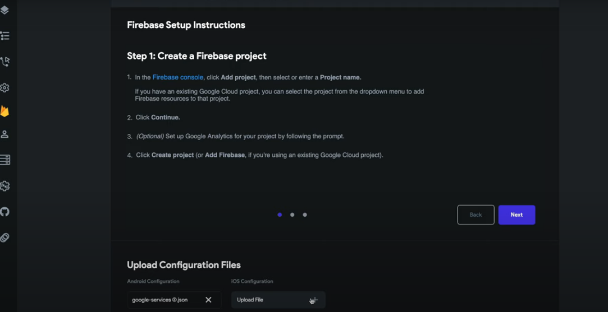

# Getting Started With Firebase

<iframe width="900" height="600" src="https://www.youtube.com/embed/vVTIafL7tw0" title="YouTube video player" frameborder="0" allow="accelerometer; autoplay; clipboard-write; encrypted-media; gyroscope; picture-in-picture" allowfullscreen></iframe>

# For a Written Tutorial, Look Below

To set up Firebase in FlutterFlow, you must first create a new project in your [Firebase Console](https://console.firebase.google.com) by pressing "Add Project"

Follow the instructions in the Firebase Console until you see a button that says "Create Project"

Wait for that to finish, and press continue

For the next part of the tutorial, you must refer to your package name in FlutterFlow. This can be done by looking in your App Settings.

In the Project Overview of the Firebase Console, under "Get Started By Adding Firebase to Your App," click the Android Button

Under where it says "Android Package Name," paste the package name from FlutterFlow.

Next, you can add an App Nickname if you'd like to

Once you are done, click "Register App"

Wait a few seconds, and click the button that says "Download google-services.json"

After this, you can keep clicking "Next" until you see a button that says "Continue to Console." Click this.

Now, your project overview page will be a little different. Click "Add App" and press the IOS button

Under "IOS Bundle ID," paste the package name from FlutterFlow, and add an App Nickname if you want

Afer this, click "Register App" and press the button that says "Download GoogleService-Info.plist"

Just like last time, click "Next" until you see a button that says "Continue to Console," and click it.

Now, you can go back to FlutterFlow, and press the "Firebase Config" button in the sidebar.

Here, it will tell you to upload your configuration files

Under "Android Configuration," select the google-services.json you just downloaded

Under "IOS Configuration," selects the GoogleService-Info.plist you just downloaded
screenshot

Congratulations, you just set up Firebase in your FlutterFlow project!
