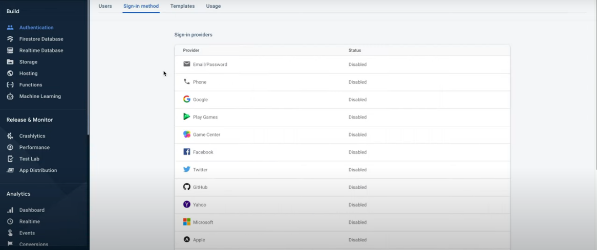

# Setting Up Firebase Authentication

<iframe width="900" height="600" src="https://www.youtube.com/embed/QeDDT713yN4" title="YouTube video player" frameborder="0" allow="accelerometer; autoplay; clipboard-write; encrypted-media; gyroscope; picture-in-picture" allowfullscreen></iframe>

# For a Written Turorial, Look Below

Under the Firebase Auth Tab in FlutterFlow, select a login page and homepage. These can be empty for the time being, but you will need to add login widgets to the login screen in order for Firebase Auth to work.

Next, go to your [Firebase Console](https://console.firebase.google.com) and click the Authentication tab in the sidebar

Next, press "Get Started"

After this, go to the Sign in Method tab and select a sign in method (you can choose multiple)

Once you click it, a pop-up will appear. For example, if you click "Email," it will look like this.

Toggle "Enable" to on, and press "Save"

Now all you need to do is create a login screen. For an easy one, you can enable google sign in in Firebase, and in the UI builder, click "Components" and drag a "Google Sign In" widget on to the screen. It's as easy as that!

