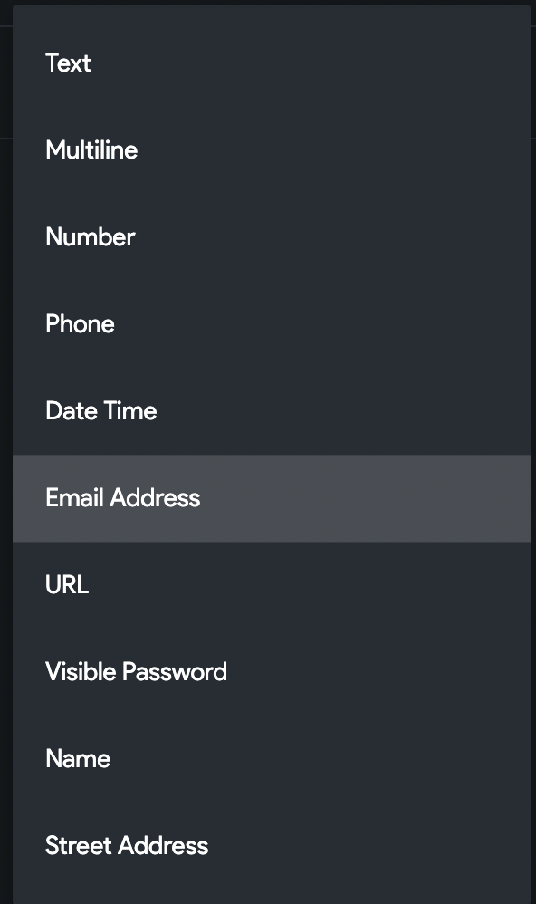
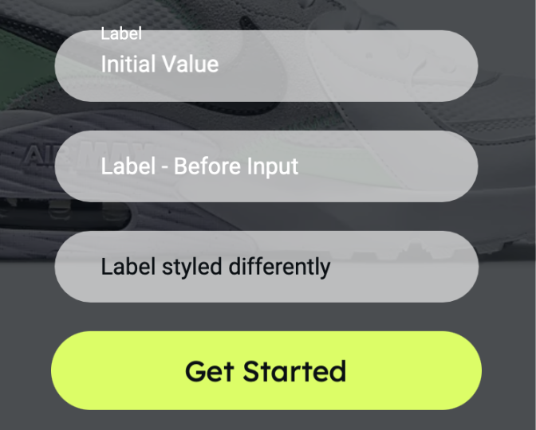
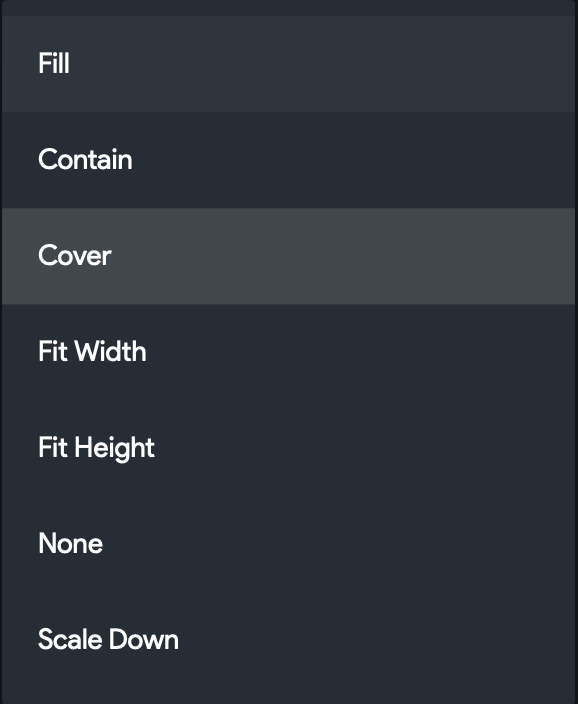

# Base Elements

# 1. Text 

The text element allows you to show text on a page, use this in order to add text to an app bar, or your page, you can change the theme styling or look and feel in the properties panel.

### Editing Text Value

After dragging your text onto the page, you can edit the text from the right side bar, there is an input that appears at the top of the properties panel. You can type in a value or you can set the text from a variable.

### Editing Text Look & Feel - Theme Styles

After you have the text that you want on the page, you can change the Theme Text Style in order to set from your theme, we provide Title 1, Title 2, Title 3, Subtitle 1, Subtitle 2, Body Text 1, Body Text 2 and custom which allows you to break the rules of your theme.

Note: You can select a theme style, i.e. “Title 1” and then adjust the size, color, weight etc. on your page and your styles will override the theme style.

### Editing Text Look & Feel - Custom

You can also select custom which allows you to manually set the font family, font weight, size & color. As well as align your text.

### Text Alignment

In order for your text to follow the “Text-Align” selection. You will need to select the text on the page and in the property pane on the right go to the Alignment section and select “Expanded”. This will make sure your text wraps and fills the parent widget it is inside. This also allows you to adjust the align property to make it align left, center, right or justified.

# 2. Textfield

A textfield or input allows a user to input text in your interface, these text fields are used for authentication, search, creating records etc. You have a variety of options when editing a text field.

### Textfield Properties

#### Password Field

You will be able to toggle a Password field on; this will hide what the user inputs initially and provide an additional option to show an icon on the right side of the input. You can set the icon size and color.

#### Show Clear Icon

This toggle will provide a small “X” at the end of your input, a user can tap this “X” to clear the value currently in the textfield. 

#### Keyboard Type

This dropdown allows you to choose what keyboard should show up by default. This is beneficial for when your textfield is suppose to capture an email instead of a standard text input, or number rather than text.

#### Initial Value

This is for when you are expecting the input to have a value already populated -- you can set this value from a variable. For example if you go through a creation process where you capture a name -- an input could have an initial value of [authenticated user] which would be the user's full name. For an unauthenticated user they would have to input their name.

#### Label Text

The label can also be placeholder text and will show even after a user has entered a value. You can type in your label text here; if you want your label text to be styled differently; scroll down and uncheck the box for “Label Style Same as above”. When you uncheck this box you will be able to adjust the styling separate from the initial value and hint text.

#### Hint Text

If no label text is defined the hint text will act as a placeholder. If a label is defined the hint text will appear as you make the input active as shown above.

### Text Input Validation

After you set the values for initial, label & hint. You have the ability to set a text field as “required” in the validation section. Toggle the “Required Field” checkbox to on, and set the text that appears if a user doesn’t fill it out.

### Text Input Validation

After you set the values for initial, label & hint. You have the ability to set a text field as “required” in the validation section. Toggle the “Required Field” checkbox to on, and set the text that appears if a user doesn’t fill it out.

#### Minimum required characters

You can set the amount of characters needed for a certain input to be valid, this is helpful for passwords or email addresses.

#### Automatically Validate

When this is toggled on, the input will be validated with every character change instead of after submitting the form.

### Leading Icon

You can set an icon to appear before you input -- this is beneficial to help spice up your designs or to add one more indicator of what each input refers to in a form.

### Input Decoration Properties

You may think how do I change the input style type? Well you will find that at the bottom.

#### Input Border Type 

This property will allow you to switch between an input with a bottom border, or an input with a full border where the label floats above. You can also toggle the “Filled” Property in order to give your input a background color.

Note: Fill color will not show up if the “Filled” Checkbox is unchecked.

You can also edit the border radius, border color and content padding of an input in this bottom section.

# 3. Image

Images allow you to upload an image from your device or set the link to an image on a network, you can also set the image as a variable from your firestore database.

### Displaying your Image

#### Width & Height

You are able to set a fixed width and height by setting both properties by exact pixels; this typically works well when the image won’t change or when whichever image is fed into this element will be the same size.

You can also set the image Width & Height as % which will be responsive to layout but could display the image differently depending on the screen size.

#### Border Radius

You can set the border radius of your image here, if you want a circle image you can also use the “Circle Image” widget as well.

#### Box Fit

You are able to set a fixed width and height by setting both properties by exact pixels; this typically works well when the image won’t change or when whichever image is fed into this element will be the same size.

