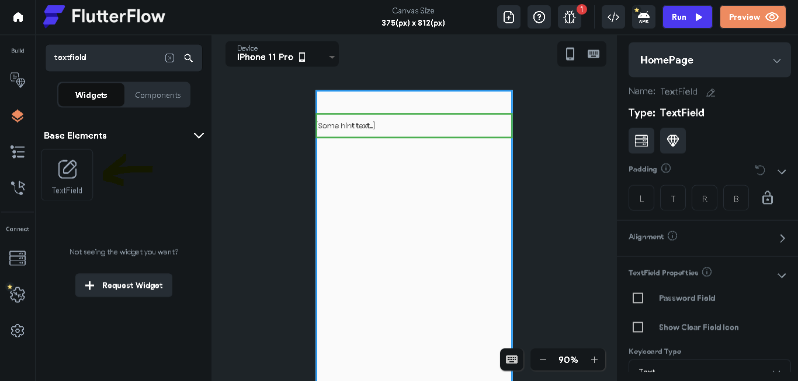

# TextField

<h2>Introduction</h2>

The TextField widget is a very common widget that lets the user enter text.

This can be useful when making a search bar, username and password fields, and so much more.

> This guide assumes you have basic knowledge of FlutterFlow, and are already signed in with a project open

# TextField in the FlutterFlow Workspace

The first thing you need to do is search for the TextField widget in the UI Builder. Once you have found it, drag it onto the empty screen.

<h2>Customizing the TextField</h2>

To customize your TextField, look at the properties section on the right-hand side of your screen. Here, you will see many options.

<h3>Padding</h4>

The first thing you will see is the Padding section. In this section, you are able to specify the padding around every side of the TextField.

<h3>Alignment</h4>

Below the padding, you will find Alignment. Here, you can specify how far left/right or up/down you want the TextField in its parent widget

<h2>Toggle Hide Password Icon</h2>
This section only appears if you check the box that says "Password Field"

Under "Toggle Hide Icon Size," you can choose how big you want the • to be. Under "Toggle Hide Icon Color," you can choose the color you want it to be.

<h2>TextField Properties</h2>

This is where things start to get fun.

<h4>Password Field</h4>
The first thing you will see is a checkbox with a label that says "Password Field" If you check this, everything the user types will become a "•"   
When you check this, another section appears (See "Toggle Hide Password Icon")

<h4>Show Clear Field Icon</h4>
Under this is another checkbox, labeled "Show Clear Field Icon." This makes an "X" appear at the right side of the textfield, which, when pressed, deletes everything the user has typed

<h4>Keyboard Type</h4>
Next, there is a dropdown labeled "Keyboard Type." In this dropdown, you can select which keyboard pops up when the user clicks the TextField

<h4>Initial Value</h4>
After this is a TextField (See how useful they are!) labeled "Initial Value." What you type into here becomes the default text for the TextField. The initial value, however, is not the hint text.

<h4>Label Text</h4>
In this TextField, you can choose to label it. This is used to make the user aware of what to put in the TextField, such as labeling it "Username" or "Password"

<h4>Hint Text</h4>
This is where you put the hint text for the TextField. This is the text that disappears when the TextField is clicked, which can be used in place of a label.

<h4>Theme Text Style</h4>
Here, you are able to choose the text style for what is typed in. Some examples are "Title 1" and "Body Text 2"

<h4>Font Weight</h4>
This is where you choose the boldness of the text, ranging from 100-thin to 900-black

<h4>Font Size</h4>
This is where you choose the font size for what the user types, just like changing the font size in a Word document.

<h4>Text Color</h4>
Here, you set the color of the text the user types in

<h4>Italic</h4>
This checkbox lets you choose if you want the text to be in italics

<h4>Text Align</h4> 
This lets you choose if you want the text to be aligned to the left, center, etc.

<h4>Max Lines</h4> 
This lets you choose the max amount of text that can be typed into the TextField

<h2>Text Input Validation</h2>

<h4>Required Field</h4>
This checkbox makes the textfield required, so it has to have something typed in it

<h4>Minimum Required Characters</h4>
This TextField lets you enter any number of characters. This can be useful when making sure a password has at least 8 characters, in order to make sure it's secure.

<h4>Automatically Validate</h4>
This checkbox means that the characters are validated in real-time to make sure they contain the required number of characters.

<h2>Loading Icon</h2>
This section lets you choose an icon to show while the TextField is loading.

<h2>Input Decoration Properties</h2>

<h4>Input Border Type</h4>
Lets you choose a border for the TextField

<h4>Filled</h4>
Lets you decide if you want the TextField filled with a certain color

<h4>Fill Color</h4>
Lets you choose what color you want the TextField to be filled with (needs Filled checkmark to be enabled)

<h4>Border Color</h4>
Lets you choose what color you want the border to be (needs a border type to be chosen)

<h4>Border Width</h4>
Lets you choose how wide you want the border to be.

<h4>Border Radius</h4>
Lets you choose the radius of the corners (only if you want the TextField to have rounded corners)

<h4>Content Padding</h4>
This lets you choose the padding around the input text (not around the TextField itself)

### Next steps

Check out other guides to learn more about how to make use of components.

* [Frequently Asked Questions](./faq/faq.md)
* [Pageview Guide](pageview.md)
